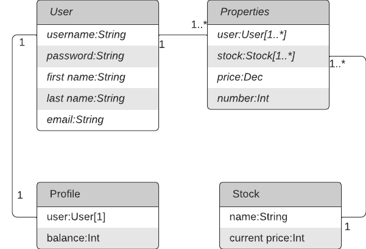

# BestHack
## Команда: AXIOM
### Направление: Web Development
### Состав команды:
- Зворыгин Владимир Андреевич,
- Есис Александр Иванович,
- Дановский Илья Валентинович

## Обзор
На платформе биржи реализована система пользователей, которая включает в себя:
- [x] Регистрация, вход, выход с сайта
- [x] Пополнение баланса
- [x] Изменение профиля
- [x] Просмотр списка акций

## Реализованные модели



## Инструкция по запуску

Чтобы запустить проект локально на компьютере:
1. Создайте виртуальное окружение и запустите его:
   ```
   python3 -m venv venv
   source venv/bin/activate
   ```
2. Перейдите в репозиторий с проектом:
   ```
   cd application/
   ```
3. Выполните следующие команды:
   ```
   pip3 install -r ../requirements.txt
   python3 manage.py makemigrations
   python3 manage.py migrate
   python3 manage.py runserver
   ```
4. Перейдите на `http://127.0.0.1:8000/`, чтобы увидеть основную страницу
